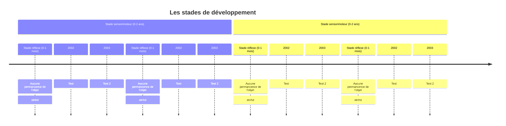

Langage, mémoire, raisonnement.
![[4_dev_cognitif_2024_2025.pdf]]

#  Les Stades de [[Piaget]]

##  0-2 - stade sensorimoteur

> Apprend par ses sens: actions circulaires + permanence de l'objet qui varie.

L'enfant apprend par ses sens et ses capacités motrices. Les premières activités motrices de l'enfant sont des réflexes. De temps à autre, il a des comportements aléatoires.
ie: il active le réflexe de succion puis fait autre chose de façon aléatoire dont il obtient des informations (essai-erreur).
Il se rend compte que ses réflexes sont insuffisants pour évoluer et va s'adapter au fur et à mesure de ses actions aléatoires. 
ie: il adapte son souffle en fonction de son environnement (souffler des bulles vs souffler une bougie).

L'enfant va répéter ses comportements mais en changeant quelque fois certaines choses pour tester l'effet du changement. Une fois le comportement et ses conséquences comprises, il pourra passer au stade suivant et les effectuer avec intention.

### 1 - Stade réflexe
Durée: 1 mois
Exerce ses réflexes sans aucune intentions et parvient à les maitriser jusqu'à un certain point.

L'enfant n'a pas encore de concept de **permanence de l'objet**. Si on lui retire quelque chose, il ne va pas pleurer car il n'a plus conscience de son existence.
### 2 - Réactions circulaires primaires
1 à 4 mois

Comportements qui ont donné des **plaisirs corporels**. Il va apprendre à adapter ses réflexes à son environnement (il suce son pouce autrement qu'il tette le sein).

**La permanence de l'objet**: L'objet continue d'exister même lorsqu'on ne le regarde pas. #tuyau 
Le bébé peut pleurer si on lui retire quelque chose mais il ne va pas aller le chercher car il pense que ça n'existe plus.

### 3 - Réactions circulaires secondaires
4 à 8 mois

Il reproduit des comportements qui ont eu un effet sur l'environnement pour obtenir le même effet. Le comportement à la base était non-intentionnel mais il va le reproduire car il a aimé la réaction. La reproduction du comportement sera alors stade 4 - avec coordination.

Exemple: le bébé met sa main dans son bol de compte, la petite sœur rit. Le bébé va alors reproduire le geste pour obtenir le rire (environnement).
## 4 - Stade de coordination des schèmes secondaires
8 à12 mois

Il va modifier ses actions pour en tester les effets sur l'environnement. 
Emergence d'une conscience de cause à effet.
Si je fais ça, il va se passer ça. Anticipation des conséquences

**Permanence de l'objet** (4-8 mois): si l'objet est en partie visible, il ira le rechercher. Si l'enfant a vu qu'on l'avait caché, il saura aller le chercher aussi.

**L'angoisse des 9 mois** - lorsqu'il n'a plus ses parents en vue, il est dans un inconfort. Il a peur que ses parents n'existent plus.
## 5 - Stades circulaires tertiaires
12 à 18 mois

Il va reproduire des comportements similaires à ce qu'il connait en les modifiant. Il varie ses comportements et teste les conséquences (assimilation/accommodation).
**Permanence de l'objet**: Il est capable d'aller trouver un objet qui a été déplacé plusieurs fois.

## 6 - Les combinaisons mentales
18 à 24 mois

Il va se créer des représentations mentales - "je fais les choses un peu différemment". L'enfant arrive à se représenter les choses et commence à sortir de l'expérience purement physique; elle devient mentale.
Il commence aussi à "faire semblant" et peut projeter des comportements (faire manger son doudou).
**Permanence de l'objet:** Même si il n'a pas vu tous les mouvements de l'objet, il va tester et chercher l'endroit le plus probable ou se trouve l'objet.

L'habituation = exposition répétée à un stimulus réduit ou stoppe une réponse; fonction d'économiser son énergie pour se concentrer sur les éléments nouveaux
Habilités perceptuelles:
Il sait distinguer un élément connu d'un élément nouveau et va se diriger vers la nouveauté.

## La mémoire:
Les bébés de quelques mois n'ont pas la mémoire très longue (~1 semaine). Un comportement appris par conditionnement est oublié après deux semaines.

Fin de la première année, le bébé arrive à se rappeler des comportements qu'il a observé (reproduit comment un autre enfant a joué avec un jouet la veille).

**Mémoire implicite:**
	Mémoire à long terme qui se produit sans effort conscient.

**Mémoire explicite**
	Mémoire à long terme qui utilise le rappel conscient des souvenirs (noms, connaissances, situations). Se rappelle où sont cachés les bonbons.
	=> Maturation de l'hippocampe.

**Mémoire de travail**
	Mémoire à court terme utilisée directement pour traiter une information.

## Le langage
L'enfant apprend à parler sans avoir conscience des règles de fonctionnement de la langue.
L'enfant est capable de communiquer sans connaitre des mots. 
Vers 5 mois, il va répéter des syllabes (baba, mama) - babillage (universel) - sans savoir ce qui se trouve derrière.

Vers 10 mois, il va comprendre quelques mots et pointe du doigt. 
Il comprend certains concepts et les exprime avec des gestes avant de pouvoir les exprimer verbalement.
Il comprend aussi les intonations de la voix.

Entre 9-12 mois, il va apprendre et utiliser les gestes sociaux conventionnels (tendre les bras pour qu'on nous porte, secouer la tête pour dire non, etc).

Le langage bébé: registre élevé, avec fluctuations, vocabulaire simple, phrases brèves. Pareil lorsqu'un enfant parle à un bébé.

13 mois: les premiers mots.
16 mois: une quarantaine de mots prononçables mais en connait 10x plus (ne sait pas produire les autres).

**Les holophrases:** capacités de transmettre un message avec un geste ("prends moi dans les bras" en tendant les bras).
**L'explosion lexicale:** il va être capable de transposer les mots qu'il connait à des contextes hors de son environnement proche ("chat" représente aussi tous les autres chats, pas seulement le sien).
**Les phrases:** 
La syntaxe va être vite assimilée (ordre des mots)
21 mois: association de 2 mots
24: phrases de plusieurs mots ("chat pas là")

[[Vygotsky]] dit que la présence d e l'adulte est essentielle car l'enfant apprend par interaction avec des individus. Si une erreur apparait, le parent va répéter dans la forme correcte (au lieu de corriger ouvertement).

# 2-6
## Stade préopératoire
la représentation symbolique
- on comprend que les concepts font référence à quelque chose de concret
- représentation mentale du temps, des lieux qui existent en dehors de son présent immédiat
- peut référer à des évènements du passé/futur et à des lieux

**Imitation différée**: reproduire un comportement d'adulte en l'absence du modèle (faire semblant).
**Jeu symbolique**: il reproduit (imitation différée) ET créé une histoire (jeu de la dinette). Fonction de régulation émotionnelle pour revivre des évènements et les ressentir à nouveau.
**Dessin**: l'enfant essaye de représenter qq chose.
**Classification**: Il est capable de regrouper des objets avec des catégories plus ou moins stables (par forme, par couleurs, ...). Vers 4 ans, il commence à pouvoir classifier des catégories abstraites (gentil, méchant).
**Les chiffres et les nombres**: vers 5 ans, il commence à compter. Il comptera avec ses doigts. Il devra donc nécessairement commencer à 1.

**Les principes de numération:**
- le principe d'ordre, 
- de cardinalité (le dernier nombre représente l'intégralité des objets), 
- le principe de la non pertinence de l'ordre de départ (de droite à gauche ou de gauche à droite, c'est pareil)
- le principe d'abstraction (on peut **tout** compter).

**La centration:** 
On ne se base que sur un élément pour tirer une conclusions sans prendre en compte tout le reste du contexte (exemple: un verre petit semble plus rempli proportionnellement si la hauteur de l'eau est plus grande, indépendamment de la largeur du verre).
"Un homme a des cheveux longs? C'est une fille."

**La non-conservation**
Le fait de pouvoir conclure que 2 quantité égales restent égales malgré leurs transformations si rien n'est enlevé ou ajouté.

**Egocentrisme intellectuel**
L'enfant a l'impression que les autres ont le même point de vue que lui.
Il a du mal à comprendre pourquoi le père appelle la grand-mère "maman" => "mamie, c'est mamie!". 
Quand l'enfant met les mains devant ses yeux, il pense que les autres ne le voient plus non plus.
- L'animise: attribuer des caractéristiques humaines à des objets (j'ai fait mal à l'arbre).
- artificialisme: tout est fabriqué par l'homme
- La causalité morale. Les lois physiques sont égales aux lois morales. Les bateaux flottent car ils sont gentils
- le finalisme: tout a un but. Les nuages bougent pour laisser la place au soleil
### La pensée magique
Pensée qui amène à croire que tout est possible. Tentative pour l'enfant de trouver des explications pour les phénomènes auxquels il n'a pas encore d'explications (bisou magique, je cours plus vite avec des chaussures à lumière).

Raisonnement transductif: Il lie deux choses entre elles souvent par le fait qu'ils arrivent l'un derrière l'autre. (le train passe et le chien aboie => le train passe parce que le chien a dit "vas-y").
Niveau clinique: Je suis malade parce que je n'ai pas été gentil. Je vais chez le psy parce que j'ai été méchant.

### La théorie de l'esprit (sonder)
Evolution de la pensée chez l'enfant entre 3 et 5 ans. C'est une prise de conscience que les autres peuvent avoir des pensées et des idées différentes de soi. Ils commencent à être capables de réflexion, de capacités d'introspection. Ils se rendent compte que les autres réfléchissent aussi et différemment.
Cette étape va avoir une influence considérable sur le développement social. On peut anticiper les réactions de l'autre (amélioration des relations).
Le mensonge apparait à partir du moment où on réalise que l'autre va penser d'une certaine façon donc on va adapter son discours.

Avant la théorie de l'esprit:
- "Qu'est ce qu'il y a dans la boite de bonbons?" 
- "des bonbons". Ensuite il voit des crayons. 
- "Si on demande à Paul ce qu'il y a dans cette boite, il dira quoi?"
- "Il dira des crayons"

## Traitement de l'information
Entre 2 et 6 ans, on voit apparaitre les mémoires à long terme (les premiers souvenirs de forment. Ils se souviennent surtout des épisodes qui ont créé de fortes réactions/émotions.

Les mémoires 
- mémoire procédurale (lacer ses chaussures, s'habiller)
- mémoire épisodique, 
- mémoire auto-biographique (souvenirs d'enfance, ma maison d'enfance, notre histoire qui reste gravée).

**L'amnésie infantile**: on oublie ce qui s'est passé dans les premières années (<2 à 4 ans).

L'étayage
Le fait de se mettre au niveau de l'enfant dans la façon dont un enseignant conçoit les activités d'apprentissage.

La myélinisation des neurones croit largement durant cette période.

### Vocabulaire
Les enfants ont vers 3 ans, ~1000 mots
Vers 6 ans, ~2600 mots

La **catégorisation rapide** permet à l'enfant d'inférer le sens d'un mot à partir d'autres mots qu'il connait déjà (exemple: chaussette ? chaussure, qu'on met au pied, etc) et d'appliquer une règle à des cas similaires (conjugaison de tous les verbes).

L'enfant n'a pas encore bien assimilé le langage intérieur donc il va parler à voix haute, vocaliser ses pensées. C'est le soliloque (parle seul).

Vers 3 ans, on a les questions du "pourquoi". Montre sa capacité à trouver des causes, des explications. Il peut faire des erreurs de surgénéralisation ("plus mieux, plus pire, un animal/des animals, il a prendu (il a perdu)").

On va corriger les erreurs non pas en lui disant que c'était faux mais en répondant en reverbalisant correctement.
> Tu peux me donner le **verre**? 
> Oui tiens voilà la **bouteille**.

### Le jeu
> Si à l'examen il y a une vidéo d'un enfant qui joue, il ne suffit pas de dire qu'il joue mais plutôt que le jeu, à cette période, est important pour ça, ça, ça et ça #tuyau.
> Ca sert à quoi d'avoir un jeu de ce type là? 
> Travaille la motricité fine, à cet âge là, elle n'est pas encore parfaite pcq on voit qu'elle dépasse. La manipulation du pinceau n'est pas encore parfait.

En fonction du type de jeu préféré, le développement sera différent pour chaque aire (coopération, agilité, comportement social, ...).

#### Le jeu fonctionnel (< 2ans)
premier jeu qui apparait dans le développement de l'enfant. Prédominant chez les enfants plus jeunes.
Actions répétitives **impliquant des mouvements musculaires** (secouer le hochet, souffler dans une trompette).
Plus tard, c'est jeux fonctionnels seront plutôt de type lancer un ballon, faire du ski.

#### Les jeux constructifs
Lego, bricolages, peinture, kapla - on construit quelque chose

#### Le jeu symbolique (~2ans)
Jeu du faire semblant. On prend les jeux pour en faire une historie. Les rôles attribués se complexifient au fil du temps. Permet de revivre des évènements de la journée et permet d'augmenter sa tolérance à la frustration. Revit les moments difficiles/frustrants. Améliore sa capacité à gérer les situations sociales.
Peut être utilisé dans un suivi thérapeutique. 

#### Le jeu formel
Jeu avec des règles, marche à suivre.

Les enfants qui aiment jouer seuls (jeu solitaire) sont souvent plus matures (à l'exception des enfants extrêmement timides).
Jouer seul quand l'enfant est chez lui, ne pas avoir besoin de qq'un pour jouer avec l'enfant est un signe de maturité.

#### Les amis imaginaires
Forme de jeu symbolique. Permet de réguler les états vécus durant la journée. L'enfant distingue la réalité de la fantaisie. Ce n'est rien de pathologique.

#### Le dessin
Développement de la motricité fine, du raisonnement, de l'intellectuel. Les différents stades de maturité cognitive et émotionnelle vont créer des niveaux de dessins différents. Pour analyser un dessin, il faut toujours avoir le contexte par l'enfant. L'enfant est le seul à pouvoir expliquer son dessin.

##### Le gribouillage
Décharge motrice, aucune intention. 
##### Le réalisme fortuit
Pas de rapport entre ce qui est dessiné et ce qui est derrière. Le dessin ne représente pas la réalité, or l'enfant a voulu dessiner une scène claire dans sa tête.
##### Le réalisme manqué
Il y a plus de correspondance avec la réalité. On voit mieux ce qu'il a essayé de dessiner.

#### Le réalisme intellectuel
rabattement: tout est aplati, pas de perspective 3D.
Schématisation: des cheveux sont représentés par une ligne droite sur la tête

#### Le réalisme visuel
Intégration de la 3D. On voit souvent une diminution du nombre de dessins, désintérêt. 
# 6-12
![[5_dev_cognitif_2024_2025.pdf]]

Stade les opérations concrètes

**La centration:** L'enfant sait maintenant prendre l'entièreté de l'objet pour tirer des bonnes conclusions. ~Cheveux longs = fille~

**La conservation**: Capable de savoir que des quantités restent les mêmes même sous forme différentes. 
- **Principe d'identité**: Si il n'y a ni ajout ni retrait, ils sont égaux. #tuyau
- **Principe de réversibilité:** Une transformation peut se faire en sens inverse (l'eau dans un verre).
- **Principe de compensation:** L'ajout dans une dimension peut être compensé par un retrait dans une autre dimension.

Conservation de la substance: vers 6-7 ans
Conservation du poids: 9-10 ans
Conservation du volume: 11-12 ans.

Le tranductisme: L'enfant conclut des choses en associant deux choses qui sont apparues en même temps. Il parvient maintenant à utiliser des raisonnements inductifs et non transductifs

**La classification**
Peut faire des catégories sur base de caractéristiques
**Inférences transitives**: Comprendre la relation entre deux objets car on comprend la relation avec de ces deux objets avec un objet tiers.
**Inclusion des classes:** Est-ce qu'il y a plus de marguerites ou de fleurs? L'enfant de ~6 ans dira marguerites car il ne sait pas que "fleurs" est un concept plus général.

**Le raisonnement inductif et déductif**
Mon chat ramène des souris, le chat de la voisine aussi => le chat aime les souris. 
On tire des conclusions générales.

Le raisonnement déductif est l'inverse du raisonnement inductif
J'utilise mes connaissances générales pour expliquer une situation.
Tous les enfants doivent aller à l'école donc l'enfant côté d'elle doit aussi aller à l'école.

**Les relations spatiales**
Meilleur notion des distances, estime le temps nécessaire.

**Nombres et mathématiques**
Il devait repartir à 1, maintenant il sait compter à partir d'un autre nombre.
Capable de faire des soustractions.

#tuyau Connaitre tous les principes listés sur le tableau de la dia 10 et 11.

**Le raisonnement hypothético-déductif**
Capacité de créer des hypothèses et de les tester.

Plus grande vitesse de traitement des informations, calculs mentaux, meilleurs mémoire de travail.

Développe la métacognition. Il peut analyser son processus de pensée.
Développe l'attention sélective. Il sait filtrer ce qui est non pertinent.

**La mémoire**
Meilleurs stratégies mnésiques. Il va noter des choses. Il va répéter à voix haute.
Il va utiliser des moyens mnémotechniques pour mieux mémoriser.

## Le langage
Il va adapter tout son langage pour correspondre aux codes sociaux. 
Raconte beaucoup de blagues et des histoires plus sophistiquées.
Plusieurs termes peuvent avoir des significations différentes selon le contexte.

# Adolescence

# Lexique

