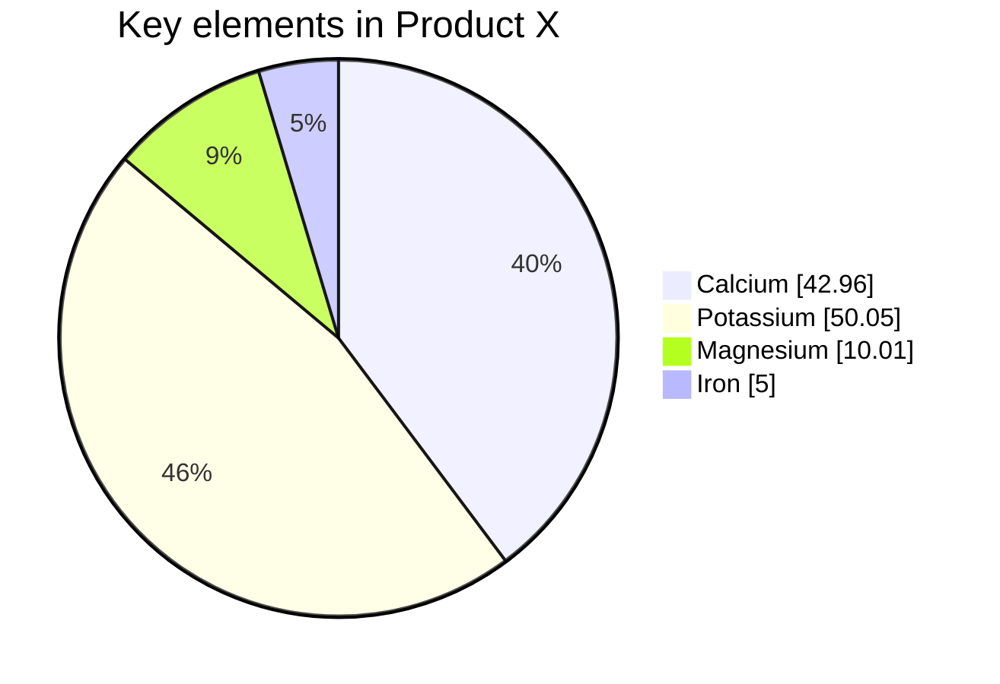

*Aurélien Cornil*

Podcasts disponibles. Les PowerPoints seront disponibles sur ECampus **après** le cours.

## Ressources

A LIRE (en visuels) https://univ.scholarvox.com/book/88957496

Livre: 
- Psychologie clinique et psychopathologie en Visuels

Certaines questions de l'examen pourront provenir des questions présentes dans les livres.

[[Psychologie clinique - Historique]]
[[Psychologie clinique - Culture]]
[[Psychologie clinique - Les différents courants]]
[[Psychologie clinique - intervention]]

 

